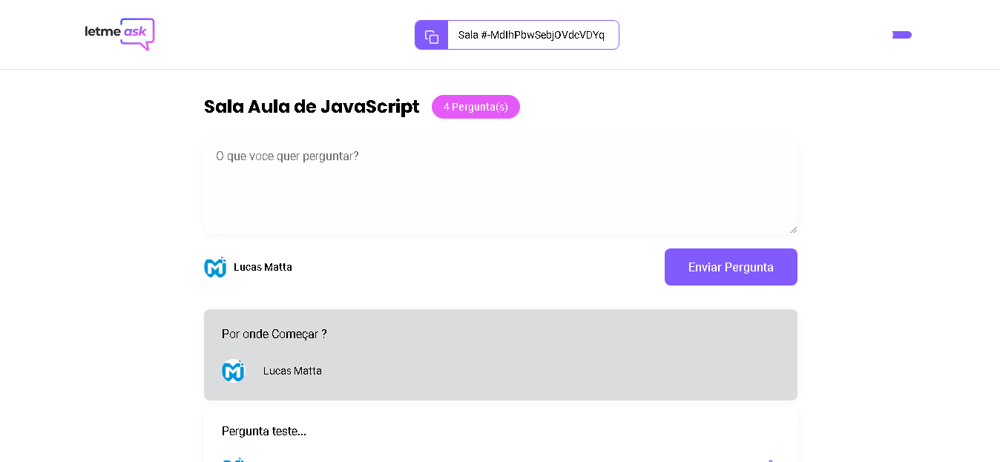
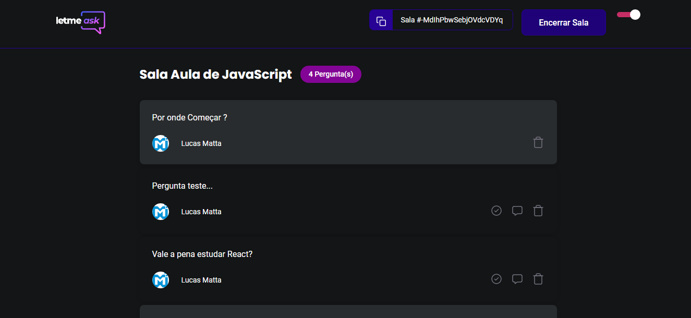

***

### 📋 Sobre o projeto

Letmeask, é uma aplicação desenvolvida com o objetivo de ajudar Stramers a criarem salas de perguntas e respostas, para o público deles enquanto fazem transmissão ao vivo. Foi desenvolvida no evento NLW da Rocketset, e com mais algumas funcionalidades adicionadas por mim, incluindo a parte adaptável para mobile (responsivo).

***

### 💻 Tecnologias Utilizadas

* React
* TypeScript
* Firebase
* Styled Components
* SCSS

***

## :wrench: Colocando o projeto para rodar

Para colocar o projeto para rodar, basta seguir o passo a passo fornecido logo abaixo:

- 1º: Tenha o NODE instalado na sua máquina;
- 2º: Faça o download deste projeto;
- 3º: Com o terminal/prompt abra o diretório deste projeto e execute o comando `npm run` ou `yarn`;
- 4º: Enquanto executa o comando... siga o passo-a-passo para configurar o firebase neste [link-firebase](https://github.com/Lucas-Matta/LetMeAsk/blob/main/firebase.md);
- 5º: Crie um arquivo `.env.local` no diretório raiz do projeto;
- 6º: Copie as variaveis do arquivo `.env.example` e cole no `.env.local`, agora preencha as informações com os dados obtidos no firebase `passo 4`;
- 7º: Após finalizado o comando do `passo 3` e com tudo finalizado, agora execute o comando `npm run dev` ou `yarn dev`;
- 8º: Pronto tudo configurado, faça bom proveito;

 

### 🎨 Layouts

