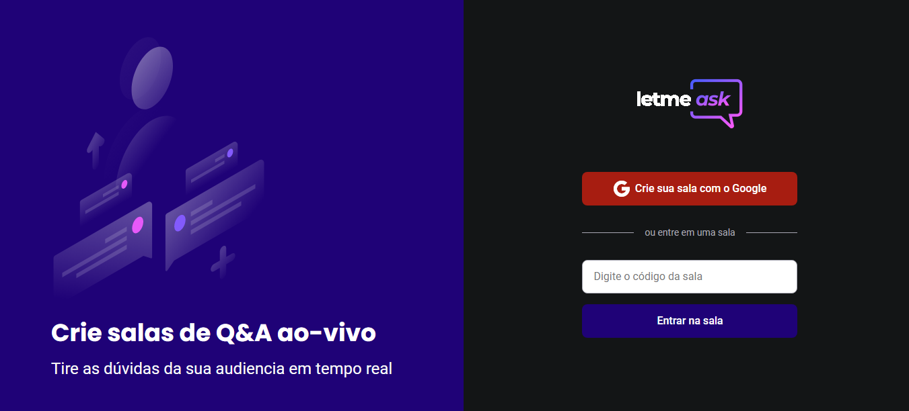

***

### 📋 Sobre o projeto

Letmeask, é uma aplicação desenvolvida com o objetivo de ajudar Stramers a criarem salas de perguntas e respostas, para o publico deles enquanto fazem transmissão ao vivo. Foi desenvolvida no evento NLW da Rocketset, e com mais algumas funcionalidades adicionadas por mim.

***

### 💻 Tecnologias Utilizadas

* React
* TypeScript
* Firebase
* Styled Components

***

### 🎨 Layouts

